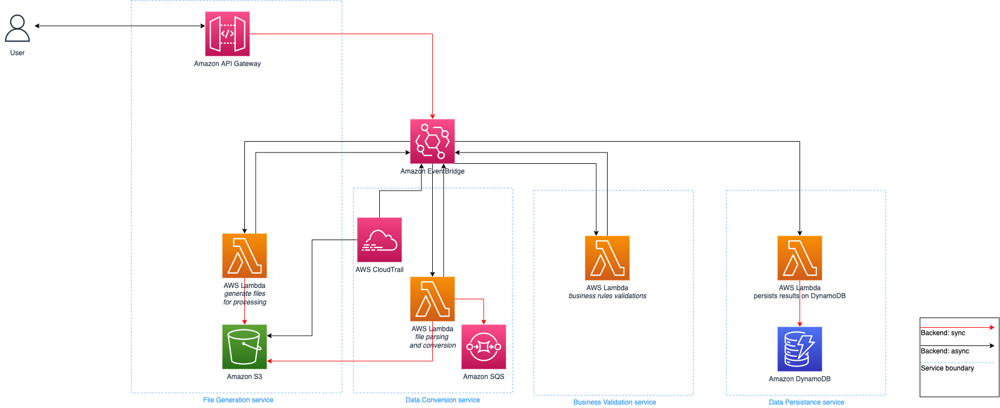

## Serverless event-driven architecture

**[Feature request](https://github.com/aws-samples/event-driven-architecture-using-s3-event-notifications/issues/new)** | **[Detailed blog post](https://aws.amazon.com/blogs/<TBD>)**

This sample application showcases how to set up an event-driven architecture for files processing using the following services:



* [AWS Serverless Application Model(SAM)](https://aws.amazon.com/serverless/sam/)
* [Amazon API Gateway](https://aws.amazon.com/api-gateway/)
* [Amazon EventBridge](https://docs.aws.amazon.com/eventbridge/)
* [Amazon Lambda](https://aws.amazon.com/lambda/)
* [Amazon Simple Storage Service(S3)](https://aws.amazon.com/s3/)
* [Amazon Simple Queue Service(SQS)](https://aws.amazon.com/sqs/)


# Setup 

The main template [template.yaml](template.yaml) is used to set up all resources using AWS SAM cli.

To build the stack, issue the following command. 
**Note**: You need to have docker installed and running to perform this.
```
sam build --use-container --container-env-var WRAPT_EXTENSIONS=false
```

Afterwards, you will need to deploy the generated stack. The following command will do it:
```
sam deploy --guided
```

You'll need to provide the following:

**Stack name**: a meaningfull name to identify the stack and its resources. Eg: *blogpost-eventdriven*  
**AWS region**: AWS region where your resources will execute. Recommendation is *us-east-1*, but any region can be used.  
**Confirm changes before deploy**: Allows you to choose whenever you want to confirm changes to be applied.  
**Allow SAM CLI IAM role creation**: Allows SAM cli to create IAM roles if necessary.  
**Disable rollback**: Disables automatic rollback of your changes if somethinng goes wrong during deploy.  
**Save arguments to configuration file**: Saves the previous answers to a file, so you can run new deploys quickier on next executions.  
**SAM configuration file**: Name of you arguments file.  
**SAM configuration environment**: Name of the profile that will be saved on the configuration file. 

After providing these parameters, SAM will start the deployment. It may take a few minutes to complete. Afterwards, you should see an output similar to the bellow:

```
CloudFormation outputs from deployed stack
------------------------------------------------------------------------------------------------------------
Outputs
------------------------------------------------------------------------------------------------------------
Key                 CloudTrailBucket
Description         S3 bucket that will store the cloudtrail events for event bridge
Value               blogpost-eventdriven-cloudtrailbucket-xxxxxxxxxxxx

Key                 FileReceiverBucket
Description         S3 bucket containing all generated files
Value               blogpost-eventdriven-filereceiverbucket-xxxxxxxxxxxx

Key                 FileGenerationCommandLinuxMacOS
Description         Command to generate the files for testing
Value               curl --location --request POST \
'https://xxxxxxxxxx.execute-api.us-east-1.amazonaws.com/filesgenerator' \
--header 'Content-Type: application/json' --data-raw '{"numberOfFiles": 100}'

Key                 FileGenerationCommandWindows
Description         Command to generate the files for testing
Value               $body = '{"numberOfFiles": 100}'
Invoke-RestMethod -uri 'https://xxxxxxxxxx.execute-api.us-east-1.amazonaws.com/filesgenerator' -method POST -body $body -ContentType "application/json"
------------------------------------------------------------------------------
```

Take note of the output(e.g., copy and paste in a text file).


# Running
To start the workflow execution, run one of the output commands(`FileGenerationCommandLinuxMacOS` or `FileGenerationCommandWindows`, depending on your operating system accordingly).

E.g., on Linux you'll likely execute: 

```
curl --location --request POST \
'https://xxxxxxxxxx.execute-api.us-east-1.amazonaws.com/filesgenerator' \
--header 'Content-Type: application/json' --data-raw '{"numberOfFiles": 100}'
```

You should get a return like the following:
```
{"Entries":[{"EventId":"092d76e2-ad83-c4b7-c135-abcd12345678"}],"FailedEntryCount":0}
```

Meaning an event has been created. Refer to the blogpost for further details.

# Undeploy
To remove all the created resources, perform the following actions on [AWS Console](http://console.aws.amazon.com):

1. Go to your AWS S3 console
2. Search for the `FileReceiver` bucket on list. Select it
3. Click on "Empty" button and confirm the exclusion.
4. Search for the `CloudTrailBucket` bucket on list. Select it
5. Click on "Empty" button and confirm the exclusion.
6. Go to AWS CloudFormation console page
7. Select the stack created using SAM
8. Click on Delete button and confirm

## Security

See [CONTRIBUTING](CONTRIBUTING.md#security-issue-notifications) for more information.

## Requirements

* [AWS SAM CLI](https://docs.aws.amazon.com/serverless-application-model/latest/developerguide/serverless-sam-cli-install.html) configured
* [AWS CLI](https://aws.amazon.com/cli/) configured
* Docker(https://www.docker.com) installed and running
* (if on Microsoft Windows) [Windows Powershell](https://docs.microsoft.com/en-us/powershell/scripting/install/installing-powershell?view=powershell-7.2) installed and running

## License

This library is licensed under the MIT-0 License. See the LICENSE file.